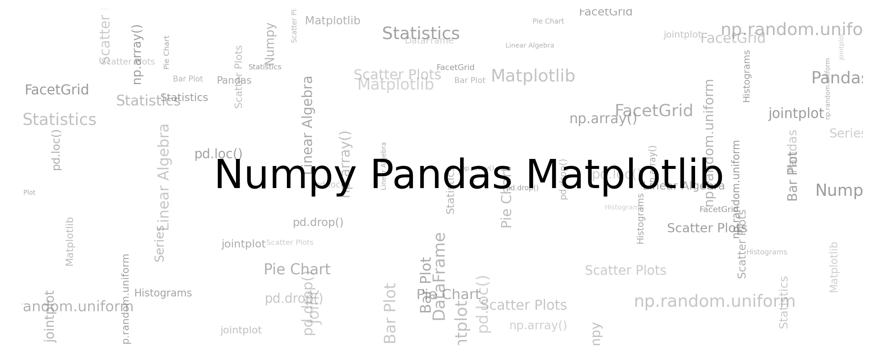

### Tutorial notebooks on numpy, pandas and matplolib

[](https://mybinder.org/v2/gh/veb-101/Numpy-Pandas-Matplotlib-Tutorial/master) [](https://colab.research.google.com/github/veb-101/Numpy-Pandas-Matplotlib-Tutorial/blob/master/) [](https://github.com/veb-101/Numpy-Pandas-Matplotlib-Tutorial/issues) [](https://github.com/veb-101/Numpy-Pandas-Matplotlib-Tutorial/pulls)
__________



* Run online using either [binder](https://mybinder.org/v2/gh/veb-101/Numpy-Pandas-Matplotlib-Tutorial/master) or [colab](https://colab.research.google.com/github/veb-101/Numpy-Pandas-Matplotlib-Tutorial/blob/master/).
* To run on your local machine; execute in either CMD or Terminal

```shell
git clone https://github.com/veb-101/Numpy-Pandas-Matplotlib-Tutorial.git
cd Numpy-Pandas-Matplotlib-Tutorial
```

* Then install the required libraries (requires **python3**)

```shell
python -m pip install -r requirements.txt (for windows)
python3 -m pip install -r requirements.txt (for linux)
```

| Sr. No. | Topic      | Notebook                                                                                                                                                                                                    |
| ------- | ---------- | ----------------------------------------------------------------------------------------------------------------------------------------------------------------------------------------------------------- |
| 1       | Numpy      | [Numpy notebook](https://nbviewer.jupyter.org/github/veb-101/Numpy-Pandas-Matplotlib-Tutorial/blob/master/numpy/Numpy%20basic%20tutorial.ipynb)                                                             |
|         |            |                                                                                                                                                                                                             |
| 2       | Pandas     | [Getting Started with Pandas](https://nbviewer.jupyter.org/github/veb-101/Numpy-Pandas-Matplotlib-Tutorial/blob/master/pandas/Getting%20started%20with%20pandas.ipynb)                                      |
|         | Pandas     | [Data Loading, Storage, and File Formats](https://nbviewer.jupyter.org/github/veb-101/Numpy-Pandas-Matplotlib-Tutorial/blob/master/pandas/Data%20Loading%2C%20Storage%2C%20and%20File%20Formats.ipynb)      |
|         | Pandas     | [Data Cleaning and Preparation](https://nbviewer.jupyter.org/github/veb-101/Numpy-Pandas-Matplotlib-Tutorial/blob/master/pandas/Data%20Cleaning%20and%20Preparation.ipynb)                                  |
|         | Pandas     | [example test](https://nbviewer.jupyter.org/github/veb-101/Numpy-Pandas-Matplotlib-Tutorial/blob/master/pandas/test.ipynb)                                                                                  |
|         |            |                                                                                                                                                                                                             |
| 3       | Matplotlib | [Part 1: Creating and Customizing Our First Plots](https://nbviewer.jupyter.org/github/veb-101/Numpy-Pandas-Matplotlib-Tutorial/blob/master/matplotlib/Part%2001%20Introduction%20and%20Line%20Plots.ipynb) |
|         | Matplotlib | [Part 2: Bar Charts and Analyzing Data from CSVs](https://nbviewer.jupyter.org/github/veb-101/Numpy-Pandas-Matplotlib-Tutorial/blob/master/matplotlib/Part%2002%20Bar%20Charts.ipynb)                       |
|         | Matplotlib | [Part 3: Pie Charts](https://nbviewer.jupyter.org/github/veb-101/Numpy-Pandas-Matplotlib-Tutorial/blob/master/matplotlib/Part%2003%20Pie%20Charts.ipynb)                                                    |
|         | Matplotlib | [Part 4: Stack Plots](https://nbviewer.jupyter.org/github/veb-101/Numpy-Pandas-Matplotlib-Tutorial/blob/master/matplotlib/Part%2004%20Stack%20Plots.ipynb)                                                  |
|         | Matplotlib | [Part 5: Filling Area on Line Plots](https://nbviewer.jupyter.org/github/veb-101/Numpy-Pandas-Matplotlib-Tutorial/blob/master/matplotlib/Part%2005%20Fill%20Between.ipynb)                                  |
|         | Matplotlib | [Part 6: Histograms](https://nbviewer.jupyter.org/github/veb-101/Numpy-Pandas-Matplotlib-Tutorial/blob/master/matplotlib/Part%2006%20Histograms.ipynb)                                                      |
|         | Matplotlib | [Part 7: Scatter Plots](https://nbviewer.jupyter.org/github/veb-101/Numpy-Pandas-Matplotlib-Tutorial/blob/master/matplotlib/Part%2007%20Scatter%20Plots.ipynb)                                              |
|         | Matplotlib | [Part 8: Plotting Time Series Data](https://nbviewer.jupyter.org/github/veb-101/Numpy-Pandas-Matplotlib-Tutorial/blob/master/matplotlib/Part%2008%20Time%20Series.ipynb)                                    |
|         | Matplotlib | [Part 10: Subplots](https://nbviewer.jupyter.org/github/veb-101/Numpy-Pandas-Matplotlib-Tutorial/blob/master/matplotlib/Part%2010%20Subplots.ipynb)                                                         |
|         | Matplotlib | [Plotting and Visualization](https://nbviewer.jupyter.org/github/veb-101/Numpy-Pandas-Matplotlib-Tutorial/blob/master/matplotlib/Plotting%20and%20Visualization.ipynb)                                      |
|         | Matplotlib | [Word Cloud](https://nbviewer.jupyter.org/github/veb-101/Numpy-Pandas-Matplotlib-Tutorial/blob/master/matplotlib/Word%20Cloud.ipynb)                                                                        |
|         | Matplotlib | [Seaborn Basics](https://nbviewer.jupyter.org/github/veb-101/Numpy-Pandas-Matplotlib-Tutorial/blob/master/matplotlib/matplotlib-seaborn-basic.ipynb)                                                        |
|         | Matplotlib | [Iris - Data Visualization](https://nbviewer.jupyter.org/github/veb-101/Numpy-Pandas-Matplotlib-Tutorial/blob/master/matplotlib/Data-Visualizations.ipynb)                                                  |
|         | Matplotlib | [Pokemon - Data Visualization](https://nbviewer.jupyter.org/github/veb-101/Numpy-Pandas-Matplotlib-Tutorial/blob/master/matplotlib/seaborn_tutorial_EDS.ipynb)                                              |
